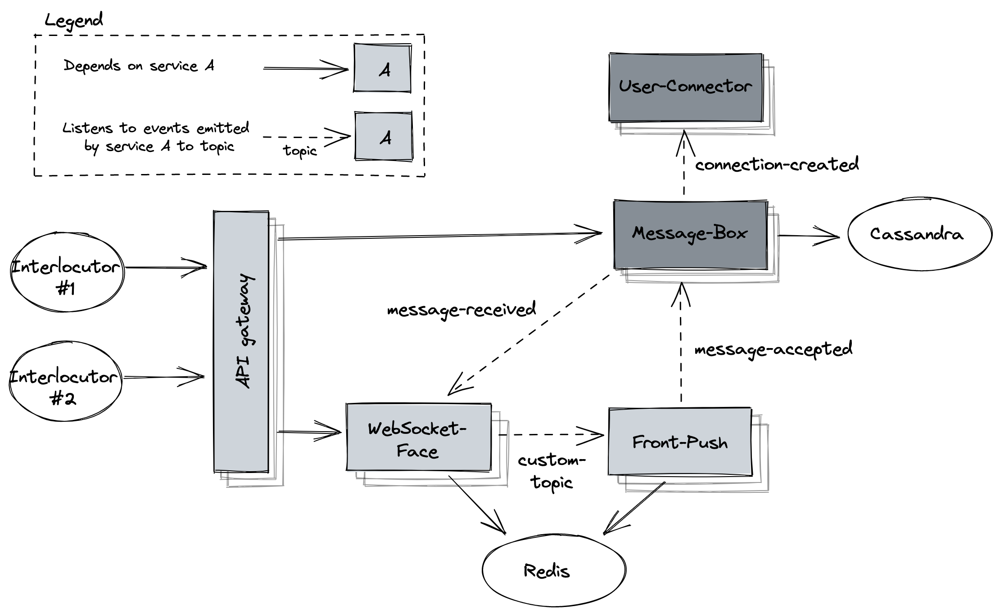

# Real time chat

## Flow  
1. Message-Box service listens to `connection-created` event and creates conversation.
2. interlocutor may create group conversation via Message-Box REST api
3. interlocutor connects to Websocket-Face service instance
4. interlocutor sends message related to particular conversation
5. Websocket-Service emits event `message-received` and pushes sent status back to the user
6. Message-Box service listens to `message-received` event
7. Message-Box service validates the incoming message and checks for recipients of the message
8. Message-Box service emits event `message-accepted` with the recipients list and stores the message
9. Front-Push service listens to the event
10. Front-Push service resolves recipients indices to topics list 
11. each Websocket-Face service listens to dedicated topic 
12. each Websocket-Faces instance emits event via websocket channel to the recipients it is connected to
13. active recipients respond with message status change
14. Websocket-Service emits event `message-status-changed`
15. Message-Box service listens to the event and updates the message status
16. Message-Box service emits event `message-status-updated` with the recipient list of all other conversation members
17. Front-Push service listens to the event and pushes it through Websocket-Face instances to the recipients

## Data structure
`conversation_by_user` table has been introduced for user's conversation retrieval from single partition.
`conversation_unread` table indicates which conversations contain unread messages
[Cassandra schema](../../cassandra/message-box.cql)