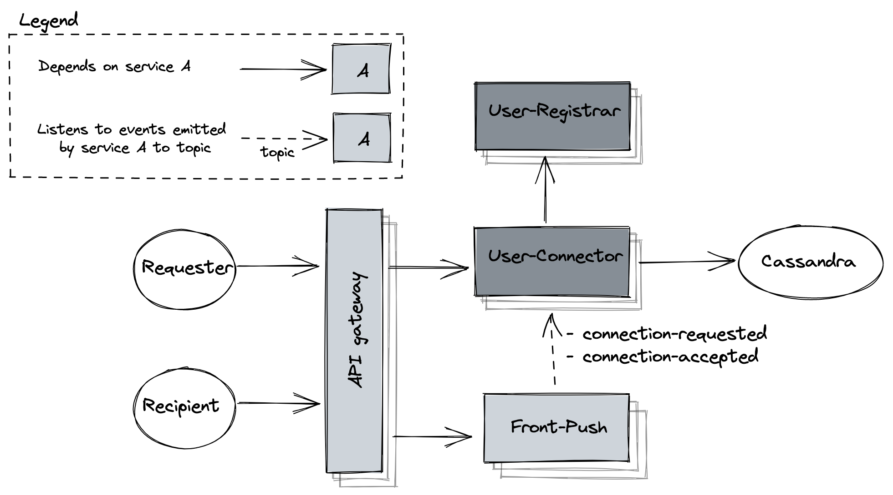

# Inter user connections

## Flow
1. requester sends connection request via REST api to User-Connector service
2. User-Connector service checks if such a requests exists 
and if users are already connected
3. User-Connector service checks if users exist by calling User_registrar service
4. User-Connector stores the request in Cassandra database
5. User-Connector emits `connection-requested` event
6. Front-Push listens to the request and pushes it the recipient if connected via web-socket
7. The recipient receives the requests either via web-socket 
or fetches all pending requests via REST call to User-Connector service
8. The recipient accepts the request via REST call to User-Connector service
9. User-Connector service stores connection record for both users and removes the request
10. User-Connector emits event `connection-accepted`
11. Front-Push pushes notification to requester if connected to web-socket

## Data structure
For performant bulk retrieval all user related connection records and connection request
records should be stored within the same partition. This is why each connection record
is duplicated.  
Thanks to clustering key records are stored chronologically.  
[Cassandra schema](../../cassandra/user-connector.cql)

## Source code
- [User Connector](https://github.com/mwojtaczka/usr-conn)