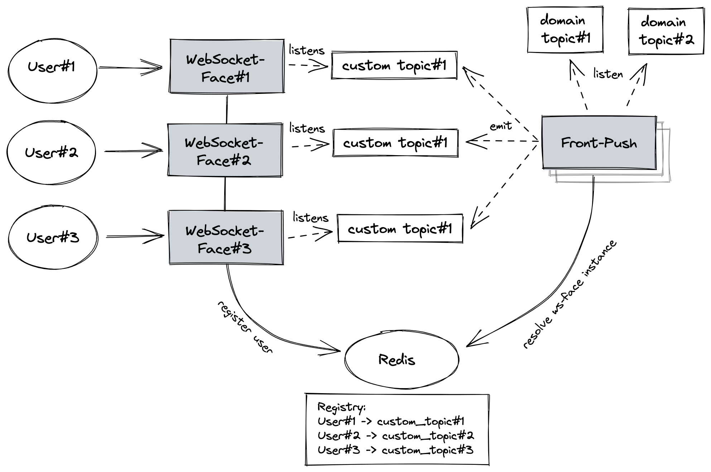

# Real time activity
Real time activities are integral part of the application that takes part 
in real time chat or real time notifications systems. In designs of the features
Front-Push and Websocket-Face services are mentioned but not really explained.  
Websocket has been used for multiplex communication between user and the application, 
however, websockets provides with stateful connection that is harder to scale.
Below has been explained how domain event reaches final recipient that is connected to certain 
WebSocket-Face instance.  
Front-Push service is the service responsible for routing domain event and it is 
protocol agnostic. WebSocket-Face service is the one that implements multiplex protocol
for communication with user.  

## Flow

1. users connect to different instances of WebSocket-Face service
2. WebSocket-Face service registers user in external registry - Redis
3. Domain services emit events (with list of recipient)  
4. Front-Push service listens to events that should be pushed
5. Front-Push service resolve each recipient to WebSocket-Face instance
6. Front-Push service emits event to proper WebSocket-Face instance's topic
7. WebSocket-Face service pushes event data to user

## Source code
- [Front Push](https://github.com/mwojtaczka/front-push)
- [Websocket Face](https://github.com/mwojtaczka/ws-face)