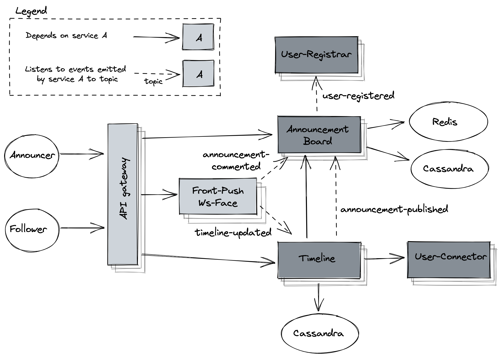

# Timeline

## Flow
1. Announcement-Board service listens to `user-registered` event
2. Announcement-Board service stores user in Cassandra
3. announcer publishes announcement via Announcement-Board REST api
4. Announcement-Board brings announcer's from Cassandra 
5. Announcement-Board emits `announcement-published` event
6. Timeline service listens to the event 
7. Timeline service fetches all announcer's followers via User-Connector Rest api 
8. Timeline service stores the announcement to each follower's timeline storage
9. Timeline service emits `timelines-updated` event
10. Front-Push listens to the event and pushes the announcement to each follower connected to websocket
11. follower fetches one's timeline via Timeline REST api
12. Timeline service brings timeline items indices from storage
13. Timeline service resolves the indices via Announcement-Board REST api
14. Announcement-Board service checks Redis cache for requested announcements
15. Announcement-Board service brings announcements from Cassandra those that are not in cache
16. Announcement-Board service returns the announcements to Timeline service 
17. Timeline service returns timeline to the follower
18. the follower fetches announcement's comments via Announcement-Board REST api
19. the follower comments the announcement via Announcement-Board REST api
20. Announcement-Board stores the comment under the announcement
21. Announcement_Board emits `announcement-commented` 
22. Front-Push listens to the event and pushes it to announcer and those who comment on the announcement

## Data structure
Timeline service stores references to announcements (id) for each follower they are meant for.  
[Timeline data schema](../../cassandra/timeline.cql)  
Announcement-Board service stores announcements and its comments. Clustering key is used to keep data 
sorted chronologically.  
[Announcement-Board data schema](../../cassandra/announcement-board.cql)  

## Source code
- [Timeline](https://github.com/mwojtaczka/timeline)
- [Announcement Board](https://github.com/mwojtaczka/ann-brd)

## TODO
Add feature for case when followee has great number of followers.